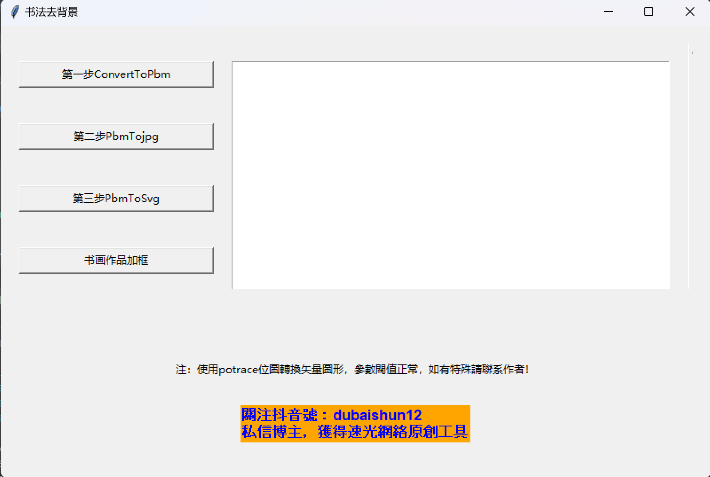

# 书法去背景

一个基于Python的图形界面工具，用于处理书法图像，包括格式转换、背景去除和添加边框等功能。

## 功能特点

- **三步转换流程**：
  1. 将JPG/PNG图像转换为PBM格式
  2. 将PBM图像转换为JPG格式
  3. 将PBM图像转换为SVG矢量格式

- **书画作品加框**：为处理后的图像添加艺术边框，边框采用了5种颜色值。

- **用户友好界面**：直观的GUI操作界面，实时显示处理进度

## 系统要求

- Windows操作系统
- Python 3.x
- 需要内置的convert.exe和potrace.exe工具（已包含在tools目录中）

## 安装步骤

1. 克隆或下载此项目到本地
2. 确保已安装Python 3.x
3. 安装必要的Python依赖：
   ```
   pip install tkinter
   ```

## 使用方法

1. 将需要处理的图像文件放入项目目录下的`pic`文件夹中
2. 运行`main.py`启动程序
3. 按照界面提示，依次点击三个步骤的按钮进行处理：
   - 第一步：ConvertToPbm - 将图像转换为PBM格式
   - 第二步：PbmTojpg - 将PBM转换为JPG格式
   - 第三步：PbmToSvg - 将PBM转换为SVG矢量格式
4. 处理完成后，可以使用"书画作品加框"功能为图像添加边框
5. 处理后的文件将保存在`pic`目录中

## 软体界面


## 注意事项

- 程序使用potrace进行位图到矢量图的转换，参数阈值已设置为常规值
- 如有特殊需求或问题，请联系作者
- 支持常见图像格式：JPG, JPEG, PNG

## 技术支持

- **速光网络软件开发**
- 官网：suguang.cc
- 联系电话/微信：15120086569
- 抖音号：dubaishun12

## 版权信息

Copyright © 2025 速光网络软件开发. All rights reserved.

---
*关注我们的抖音账号获取最新更新和技术支持！*